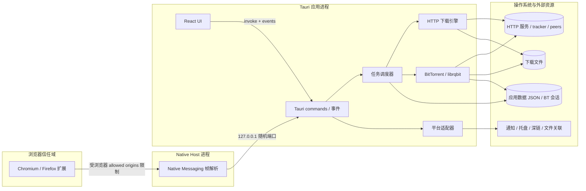

# 架构总览

Multidown 是一个单进程 Tauri 桌面应用，并包含独立的浏览器扩展和 Native Messaging Host。React 负责交互，Rust 负责网络、文件、持久化及平台能力。

## 组件职责

- React UI：收集用户意图、展示任务状态，不直接拥有下载和文件写入权限。
- Tauri 命令层：验证前端参数、调用调度器、返回稳定的序列化结果，并负责窗口事件。
- 调度器：统一管理 HTTP 与种子任务、并发、队列、重试、计划任务、规则及持久化。
- HTTP 引擎：探测远端能力，拆分 Range，流式写盘，校验续传条件。
- BitTorrent 子系统：解析输入、管理 librqbit 会话、文件选择、做种和 fastresume。
- 平台适配器：封装深链、磁力/种子关联、系统代理、自启、托盘和通知差异。
- 浏览器集成：扩展只处理浏览器上下文，Native Host 将允许的消息转发到本机应用。

## 信任边界

URL、HTTP 元数据、种子文件、peer 消息、浏览器消息、深链和命令行参数都属于不可信输入。文件系统、代理凭据、Cookie 和认证头属于敏感资源。跨越这些边界时必须限制协议、规范化路径、避免日志泄密，并由 Rust 层作最终验证。

各子系统细节见 [HTTP 下载引擎](./download-engine.md)、[BitTorrent](./bittorrent.md)、[浏览器集成](./browser-integration.md)、[持久化](./persistence.md)和[安全模型](./security.md)。
